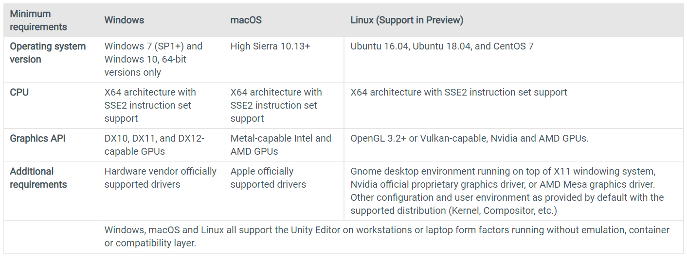

# An introduction 
This page is to give an understanding of game dev and what it kind of takes to do game dev. 

Quick back story on how i got into Game Development. I got into Game Development becuase i really liked games and really wanted to create a game but at the time i didn't know how to code and didn't have the motivation to keep going so ended i gave up on the project i was working on whichhappened three times before i actually got the motivation to and the knowledge to create the game i'm creating now

# How to get started:
Read All the start items below before actually getting started. First of all to get started your going to need a computer or a laptop with Windows, mac or linux installed. the minimum specs are show below:

How to get everything install:
1. setup unity i recommend folling this tutorial: [how to setup unity](https://www.youtube.com/watch?v=ewiw2tcfen8)
    - he uses visual Studio but just use visual Studio code instead 
    - you won't need to worry about licensing just use te free version
2. Download and install [unity](https://unity.com/download) You'll need an account so just sign up for that it's all free
3. Download a Code IDE i recommend:
    * [Visual Studio Code](https://code.visualstudio.com/) is Easy to use and setup and is what i use for unity and my coding
    * [Visual Studio](https://visualstudio.microsoft.com/vs/) is Harder to setup but is recommened for C# but not necessary

Once you finished with the setup you probably want to get straight into the game dev part but sadly it's a not that easy. It takes time to learn unity and how to code but don't let this deter you it's all part of the fun. Also note that your first game will not be your dream game and that it shouldn't be as it'll deter you away and you'll end up giving up on it i did the same thing when i started.

## To learn coding i recommend 2 places 

1. Brackeys youtube channel which has a part on C# click [here](https://youtube.com/playlist?list=PLPV2KyIb3jR4CtEelGPsmPzlvP7ISPYzR) to have a look
2. [SoloLean](https://www.sololearn.com/) which is free besides running code all you need is create an account this is where i've learnt most of my cosing from

## To Learn Unity i recommend
[Brackeys youtube channel](https://www.youtube.com/c/Brackeys) is one of the best places and how is how i learnt Unity. He has quite a few playlists on creating different games but this one is the best: [How to make a videogame](https://youtube.com/playlist?list=PLPV2KyIb3jR53Jce9hP7G5xC4O9AgnOuL) and is quite simple to follow and at the end you have a cool game that you can play and show your friends

# Where you can find help if your stuck
Alot of the places you'll find yourself going to help when something is working is Brackeys community, stackOverflow (for when your code doesn't work) and a few other places
Links to places: 
1. Brackeys
    - [Youtube Channel](https://www.youtube.com/c/Brackeys)
    - [Discord](https://discord.com/invite/brackeys)
2. [stackOverflow](https://stackoverflow.com/) 

over time you will find the community that stuits you and on where you can find the help and there are plenty of tutoials and playlist out there to help you get started.

# Closing note
Game Development is hard but rewarding. It takes time to create your first game which may not be what you expected or vert good but we all started there at some point. No one became good at making games without alot of bad games and alot of wasted hours on things that were really simple. Overtime you will learn new things and soon be able to create your dream game
